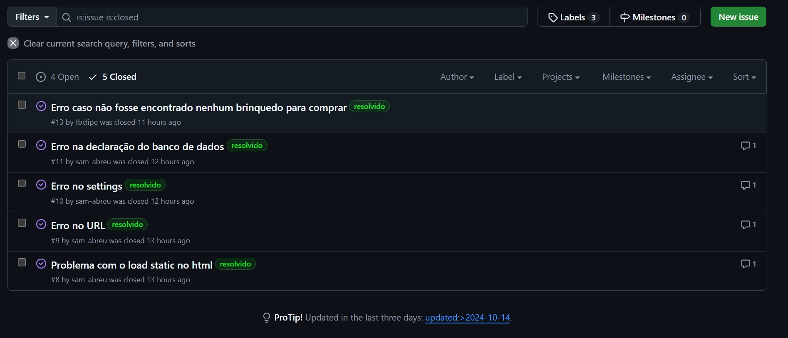

<!DOCTYPE html>
<html lang="pt-BR">
<head>
    <meta charset="UTF-8">
    <meta name="viewport" content="width=device-width, initial-scale=1.0">
</head>
<body>
 

<h1 align="center">Grupo 10 projetos</h1>

[SR1](#SR1) &nbsp;|&nbsp; [SR2](#SR2) &nbsp;|&nbsp;[Linguagens](#linguagens) &nbsp;|&nbsp; [Colaboradores](#colaboradores)

 

<h2>💻 Projeto</h2>

<h3>O que consiste esse projeto</h3>

 
✔️ Atualização de uma forma de venda e administração de negócios de uma empreendedora que busca priorizar valores e boas práticas nas vendas.
  
✔️ Ajudar na exposição da ideia e dos valores que são a base do desenvolvimento da empresa da fábrica de ideias.
  
✔️ Contribuir com a reciclagem e o correto descarte dos produtos, por meio de uma viabilização de um canal de descarte de material reciclável para a confecção de brinquedos novos.
  
✔️ Organizar e implementar de forma efetiva os desejos e pensamentos da sonhadora e empresária (nome da cliente que no momento não me recordo).
  
✔️ Implementar um sistema de vendas que acumule pontos e benefícios para compradores recorrentes para criar uma experiência de compra engrandecedora.
 

<h4>A conclusão deste projeto não apenas ajudará a empreendedora (nome dela que ainda nao me lembro) a aumentar seu negócio, mas irá aumentar a quantidade de pessoas a serem conscientizadas de maneira que compreendam, como uma economia sustentável e o incentivo a práticas com um retorno ambiental positivo, pode ser de grande ajuda ao nosso meio ambiente e como isso é um tema tão necessário e importante de ser comentado.</h4>

 

<h2 id="linguagens">📑Linguagens</h2>

Esse projeto foi desenvolvido com as seguintes linguagens:

 ✔️ Python
 ✔️ JavaScript
 ✔️ HTML
 ✔️ CSS

 

    
Colaboradores

    <table>
        <tr><td>Antonio Crisanto</td><td>Email: actf@cesar.school</td></tr>
        <tr><td>Artur Dowsley</td><td>Email: abd2@cesar.School</td></tr>
        <tr><td>Daniel Alves</td><td>Email: dfa2@cesar.school</td></tr>
        <tr><td>Felipe Barros</td><td>Email: fbc@cesar.school</td></tr>
        <tr><td>Henrique Gueiros</td><td>Email: hwg@cesar.school</td></tr>
        <tr><td>Samuel Abreu</td><td>Email: slag@cesar.school</td></tr>
        <tr><td>Thiago Nadler</td><td>Email: tlns@cesar.school</td></tr>
    </table>

    
Links Importantes

    
jira: https://cesar-team-ztgvnfkx.atlassian.net/jira/software/projects/G1P/boards/34?atlOrigin=eyJpIjoiNjc5NjA2NWIyZWVmNGUyMjhmMTUxYjRlMDk1ODA1YTUiLCJwIjoiaiJ9

    
Miro: https://miro.com/app/board/uXjVKqyeyhk=/

    
Link do Azure: https://toytopia.azurewebsites.net 

    
Screamcast do prototipo de  baixa fidelidade: https://youtu.be/tR92qqrbJLQ  

<!-- SR1 -->

    
SR1

    

        
JIRA

        <h3>Print do Backlog (JIRA):</h3>
         
        
        <h3>Print do Quadro</h3>
         
        
    

    

    
Bug Tracker

    <h3>Print do quadro Bug Tracker
     
    <h4>Open:</h4>
    
     
    <h4>Closed:<h4>
    
    

<!-- SR2
 -->

    
SR2
    

    

        
🔧 Em andamento...🔧

    

  

<h1>🔧 Em construção... 🔧</h1>

</body>
</html>
